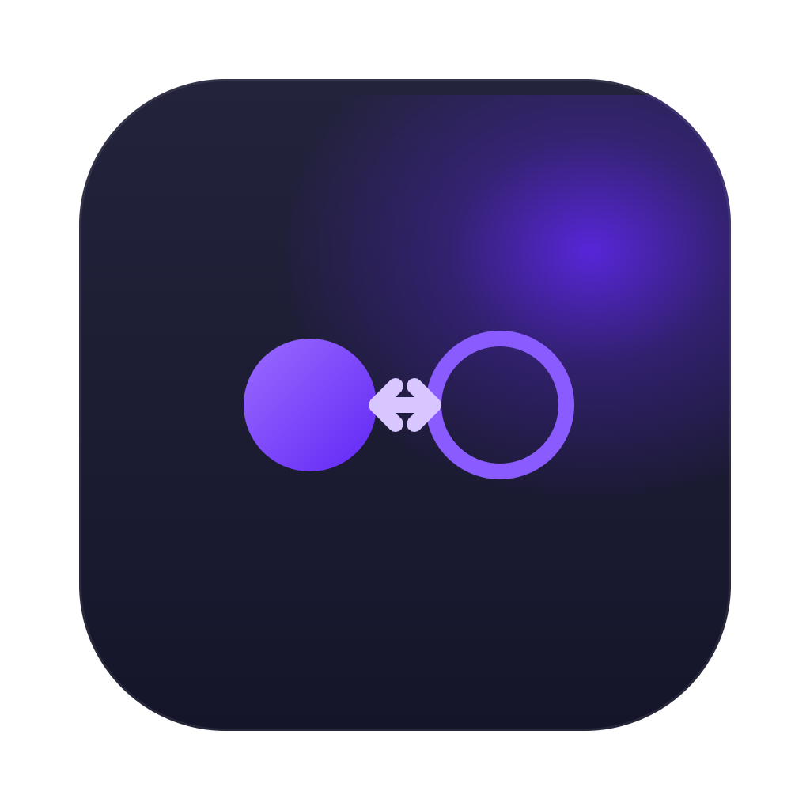

# LLM Flex

**Switch the AI model inside Claude Code and Codex — one click, no config editing.**



> 🚧 **Alpha (v0.x).** This is early software. Expect rough edges, and please send feedback — it's exactly what this stage is for. Use the **envelope icon** inside the app to email the team, or file a GitHub issue.

---

## 🤔 What is this?

Claude Code and OpenAI Codex are AI coding assistants that run in your terminal or editor. They're powerful, but each one is set up to use a specific AI model by default. Switching to a different model — a cheaper one, a faster one, or one from a completely different company — normally means finding and manually editing config files.

LLM Flex is a small Mac app that lives quietly in your menu bar. You create **profiles** — each one is a saved combination of AI provider, model, and API key — and switch between them with a single click. The app handles the configuration in the background so you never have to.

**If you use Claude Code or Codex and want to try different models or providers, this is for you.**

---

## ⚡ How it works

1. ⬇️ **Download and install** LLM Flex (see below).
2. 🔑 **Get an API key** from your chosen AI provider — Anthropic, OpenRouter, OpenAI, etc.
3. 🗂️ **Create a profile** in LLM Flex: pick your provider, paste in your API key, choose a model.
4. ✅ **Hit Apply.** LLM Flex updates Claude Code and/or Codex in the background.
5. 🚀 Start a new coding session — it's now running on the model you chose.

To undo everything and go back to how things were before you installed LLM Flex, click **Restore defaults**.

---

## ⬇️ Download & install

1. Go to the [Releases page](https://github.com/futureformed/llmflex/releases) and download the latest `LLM-Flex-x.y.z.dmg`.
2. Open the DMG and drag **LLM Flex** into your Applications folder.
3. Launch it from Applications. LLM Flex appears as an icon in your menu bar.

### ⚠️ First launch: the "unidentified developer" warning

Because LLM Flex isn't yet notarized through Apple's paid program, macOS will warn you the first time you open it. This is expected and normal for an unsigned alpha. To get past it:

- **Right-click** (or Control-click) LLM Flex in Applications → **Open** → **Open** again in the dialog that appears. macOS remembers your choice and won't ask again.
- If macOS still won't open it, paste this into Terminal and press Enter:

  ```bash
  xattr -dr com.apple.quarantine "/Applications/LLM Flex.app"
  ```

The app is fully open source — you can read exactly what it does in this repo.

---

## 🚀 Getting started (step by step)

### 1. 🔑 Get an API key from a provider

An **API key** is a secret credential that lets an app use an AI service on your behalf (and bills you for usage). You generate one on the provider's website, copy it once, and paste it into LLM Flex. It's stored in your macOS Keychain — never written to a file or log.

Different providers work with different tools, so pick based on what you're using:

| Provider | Works with | Where to get a key |
| --- | --- | --- |
| **Anthropic** (Claude) | Claude Code | [console.anthropic.com](https://console.anthropic.com) → Settings → API Keys → Create Key |
| **Opencode Go** | Claude Code | [opencode.ai/zen](https://opencode.ai/zen) |
| **OpenAI** | Codex | [platform.openai.com/api-keys](https://platform.openai.com/api-keys) → Create new secret key |
| **OpenRouter** | Codex | [openrouter.ai/keys](https://openrouter.ai/keys) → Create Key (one key, access to many models) |
| **LM Studio** | Codex | Runs on your own Mac — no key needed |

> 📋 **Copy the key the moment it's shown.** Most providers only display it once. It usually starts with `sk-…`. Treat it like a password — don't share it.

> ℹ️ **Gemini, Ollama, and custom endpoints** also appear in the provider list. These don't speak either tool's native API directly, so Apply won't work unless you're routing through a compatible proxy. The app shows a note explaining this when it applies.

### 2. 🗂️ Create a profile in LLM Flex

A **profile** is one saved combination of provider, model, and key.

1. Click the **↔ icon** in your menu bar to open LLM Flex.
2. Under **PROFILES**, click **+ Add**.
3. Fill in the form:
   - **Name** — anything memorable, e.g. "OpenRouter — Sonnet" or "Anthropic — Haiku".
   - **Provider** — pick the one you got a key for. The base URL fills in automatically.
   - **API key** — paste the key you copied. It stays in your Keychain.
   - **Model** — type a model name, or click the **list icon** to browse a curated Quick Pick of current models.
4. Click **Test connection** to confirm your key and model are working.
5. Click **Save**.

### 3. ✅ Apply it

Back in the menu, click **Apply** next to the profile. The status panel at the top turns green, showing the active provider and model for Claude Code and Codex. Your next session picks up the new model automatically — no restart needed.

> 💡 **Codex tip:** if Codex is currently signed in with a ChatGPT account, switching is blocked — Codex refreshes its own token on launch and would overwrite your key. Sign out of ChatGPT inside Codex's settings first, then apply.

---

## 🛠️ For contributors

### Build from source

```bash
swift test        # run unit tests
./build.sh        # produce build/LLM Flex.app
open 'build/LLM Flex.app'
```

### Project layout

- `Sources/LLMFlexCore/` — pure logic, no UI. All unit-tested.
- `Sources/LLMFlex/` — SwiftUI app.
- `Tests/LLMFlexCoreTests/` — XCTest target.
- `build.sh` — wraps the SPM release build into a signed `.app` bundle.
- `scripts/package-dmg.sh` — builds the app and packages it as a distributable DMG.

**Requirements:** macOS 14.0+, Swift 5.9+.

### Versioning & releases

Version lives in [`VERSION`](VERSION). Notable changes are tracked in [`CHANGELOG.md`](CHANGELOG.md). The project follows [Semantic Versioning](https://semver.org); `0.x` is alpha.

To cut a release:

1. Bump [`VERSION`](VERSION) (e.g. `0.2.0` → `0.3.0`).
2. Move items under `## [Unreleased]` in `CHANGELOG.md` into a new `## [x.y.z] - YYYY-MM-DD` section.
3. Commit, tag, and push:

   ```bash
   git tag v0.3.0
   git push origin main --tags
   ```

Pushing a `v*` tag triggers [`.github/workflows/release.yml`](.github/workflows/release.yml), which runs tests, builds the DMG, and publishes a GitHub Release. To build a DMG locally instead:

```bash
./scripts/package-dmg.sh   # → build/LLM-Flex-<version>.dmg
```

### Updating the model catalog

The **Quick Pick** list in the profile editor is populated from [`Sources/LLMFlexCore/Models/ModelCatalog.swift`](Sources/LLMFlexCore/Models/ModelCatalog.swift). When providers ship new models:

1. Edit the array for the relevant provider. Each entry has `id` (the API string), `label` (human-friendly name), and optional `notes`.
2. Run `swift test && ./build.sh`.
3. Commit.

Current doc sources:
- Anthropic — https://docs.anthropic.com/en/docs/about-claude/models/overview
- OpenAI — https://platform.openai.com/docs/models
- OpenRouter — https://openrouter.ai/models
- Opencode Go — https://opencode.ai/zen/go
